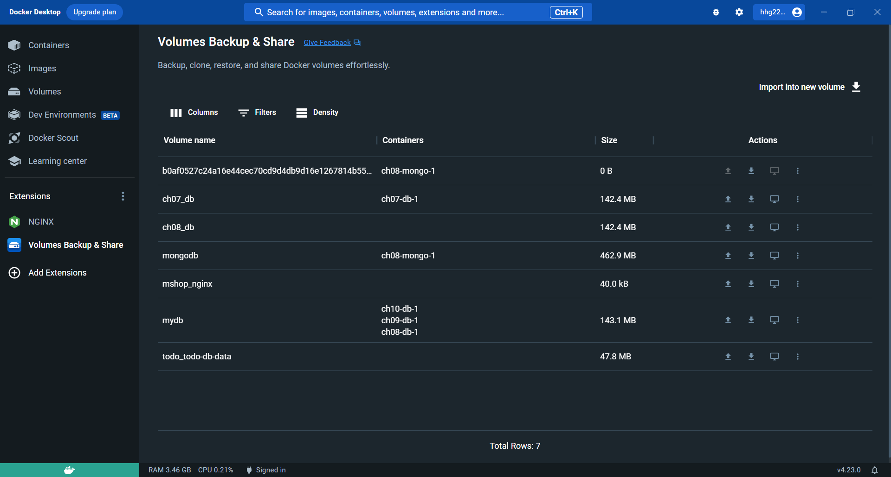

# Clone Docker Volume

## step 1. Create a new volume

```docker
docker volume create NEW_VOLUME_NAME
```

## step 2. Run the code

```docker
docker run --rm --volumes-from OLD_VOLUME_NAME -v NEW_VOLUME_NAME:/target alpine sh -c "cp -rp VOLUME_PATH/. /target
```

## Code

* ### In this case, the variables are as follows

  * **OLD_VOLUME_NAME = ch07-db-1**

  * **NEW_VOLUME_NAME = mydb**

  * **VOLUME_PATH = /var/lib/mysql/**

```YAML
version: '3.7'
services:

    db:
        image: mariadb:10.6
        ports:
            - "3307:3306"
        volumes:
            - mydb:/var/lib/mysql
        environment:
            MYSQL_DATABASE: ${MYSQL_DATABASE}
            MYSQL_ROOT_PASSWORD: ${MYSQL_ROOT_PASSWORD}
        networks:
            - app-net

    phpmyadmin:
        image: phpmyadmin
        ports:
            - "8080:80"
        environment:
            - PMA_ARBITRARY=${PMA_ARBITRARY}
        networks:
            - app-net

    networks:
        app-net:

    volumes:
        mydb:
            external: true`
```

> [!IMPORTANT]
> 現在Docker有套件(Volumes Backup & Share)可以幫忙複製volume，也可以分享、上傳。


