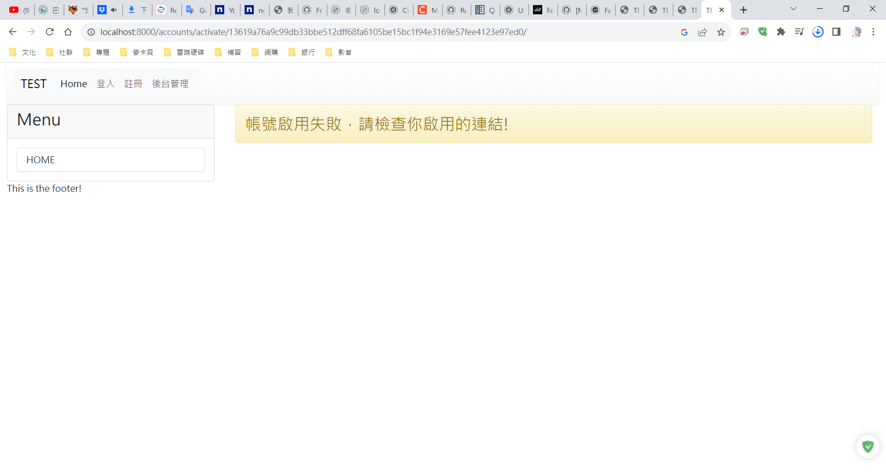
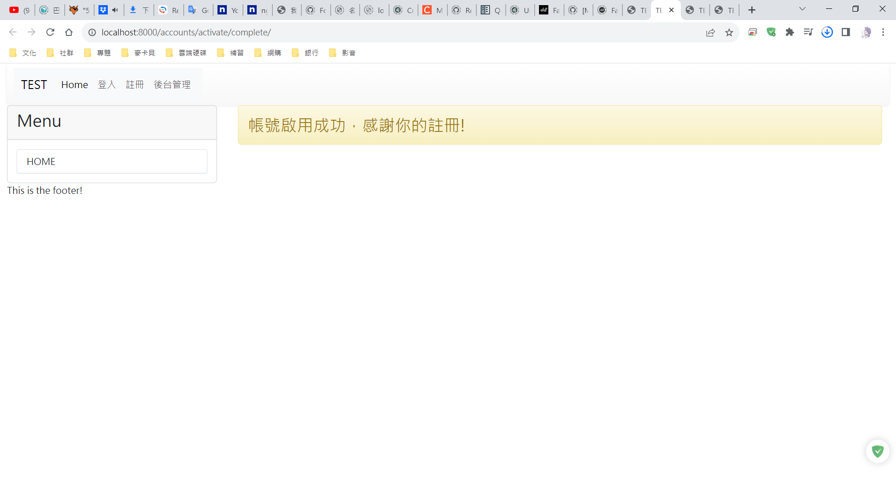
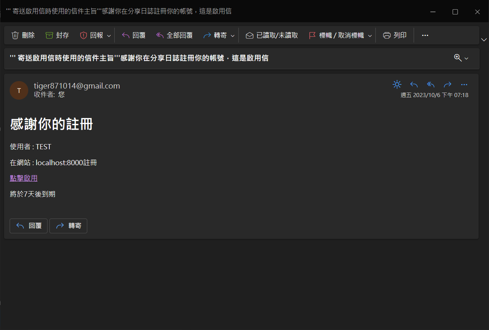
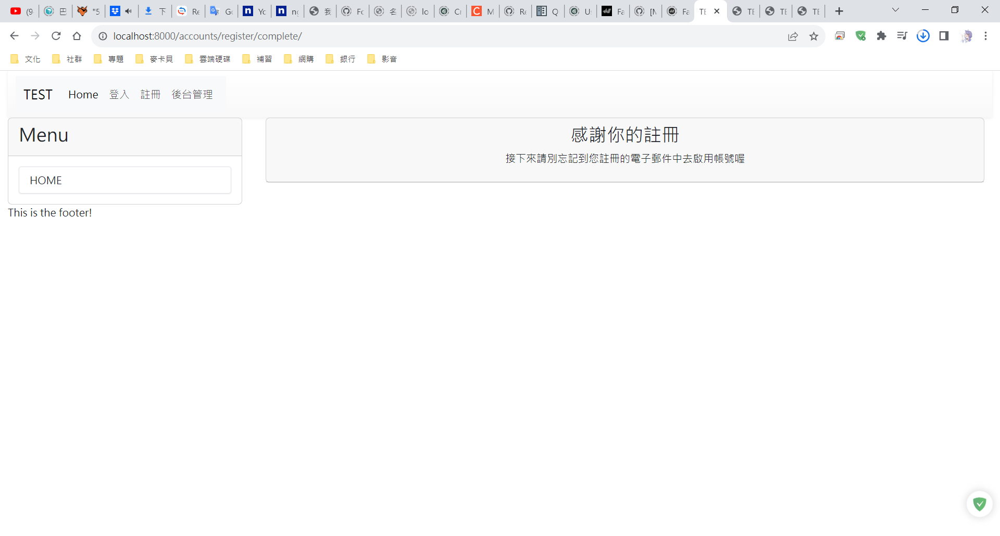
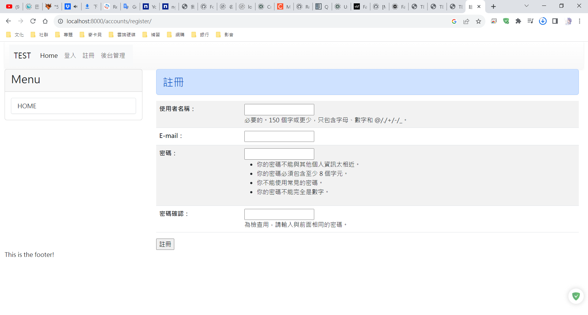

# django-registration-redux安裝與設定

## Description

django-registration-redux 是一個提供`使用者註冊`功能的框架。[官方網站](https://django-registration-redux.readthedocs.io/en/latest/)

## 安裝套件

```bash
pip install django-registration-redux
```

## 設定

* ### setting.py

```python
INSTALLED_APPS = [
    'django.contrib.admin'
    'django.contrib.auth'
    'django.contrib.contenttypes'
    'django.contrib.sessions'
    'django.contrib.messages'
    'django.contrib.staticfiles'

    'mysite'
    # registration要放在app(mysite)的下面，因為會用到django的auth，需要知道路徑
    'registration'
]

EMAIL_BACKEND = "django.core.mail.backends.smtp.EmailBackend"
EMAIL_HOST = "smtp.gmail.com"
EMAIL_PORT = 587
EMAIL_USE_TLS = True
EMAIL_HOST_USER = "tiger871014@gmail.com"
EMAIL_HOST_PASSWORD = "emdnfkqcmruujzwk"

# 設定啟用碼(啟用帳號的最長期限)的天數
ACCOUNT_ACTIVATION_DAYS = 7
```

* ### urls.py

```python
from django.urls import path, include
urlpatterns = [
    path('accounts/', include('registration.backends.default.urls'))
]
```

* ### html

```html
<a class="nav-link" href='/accounts/logout'>登出</a>
<a class="nav-link" href='/accounts/login/?next=/'>登入</a>
<a class="nav-link" href='/accounts/register'>註冊</a>
```

> [!IMPORTANT]
> \<a class="nav-link" href='/accounts/login/?next=/'>登入<\/a><br>
> `href='/accounts/login/?next=/'`必須要完整且正確。

* ### migrate

所有的配置都完成後再來migrate。

```BASH
python manage.py makemigrations

python manage.py migrate
```

> [!IMPORTANT]
> settings.py的INSTALLED_APPS一定要先加上`registration`才可以migrate。

## 創建registration資料夾在templates資料夾之下，並建立以下的檔案

```tree
├─templates
│  │
│  │  HTML FILES
│  │
│  └─registration
│          activate.html
│          activation_complete.html
│          activation_email.html
│          activation_email_subject.txt
│          registration_complete.html
│          registration_form.html
```

* ### activate.html

```html
<!-- activate.html -->
<!-- 當帳號啟用失敗顯示的畫面-->

分享日誌

<div class='container'>
    
        <div class="alert alert-{{ message.tags }}">{{ message }}</div>
    
    <div class='row'>
        <div class='col-md-12'>
            <h3 class="alert alert-warning">帳號啟用失敗，請檢查你啟用的連結!</h3>
        </div>
    </div>
</div>

 ```



* ### activation_complete.html

```html
<!-- activation_complete.html -->
<!-- 當帳號完成啟用顯示的畫面-->

分享日誌

<div class='container'>
    
        <div class="alert alert-{{ message.tags }}">{{ message }}</div>
    
    <div class='row'>
        <div class='col-md-12'>
            <h3 class="alert alert-warning">帳號啟用成功，感謝你的註冊!</h3>
        </div>
    </div>
</div>

```



* ### activation_email_subject.txt

```html
<!-- 寄送啟用信時使用的信件主旨 -->
感謝你在分享日誌註冊你的帳號，這是啟用信
```

* ### activation_email.html

```html
<!-- activation_email.html -->
<!-- 寄送啟用信時使用的信件頁面 -->
<!DOCTYPE html>
<html>
    <head>
        <meta charset="UTF-8">
        <meta http-equiv="X-UA-Compatible" content="IE-edge">
        <meta name="viewport" content="width=device-width, initial-scale=1.0">
        <title>Document</title>
    </head>
    <body>
        <h1>感謝你的註冊</h1>
        <p>使用者 : {{ user }}</p>
        <p>在網站 : {{ site }}註冊</p>
        <a href="http://{{ site }}/accounts/activate/{{ activation_key }}">點擊啟用</a>
        <p>將於{{ expiration_days }}天後到期</p>
    </body>
</html>
```



* ### registration_complete.html

```html
<!-- registration_complete.html -->
<!-- 顯示按下註冊後的網頁-->

分享日誌

<div class='container'>
    
        <div class="alert alert-{{ message.tags }}">{{ message }}</div>
    
    <div class='row'>
        <div class='col-md-12'>
            <div class="card">
                <div class="card-header" align=center>
                    <h3>感謝你的註冊</h3>
                    <p>接下來請別忘記到您註冊的電子郵件中去啟用帳號喔</p>
                </div>
            </div>
        </div>
    </div>
</div>

```



* ### registration_form.html

```html
<!-- registration_form.html -->
<!-- 顯示註冊表單的網頁-->

註冊分享日誌

<div class='container'>
    
        <div class="alert alert-{{ message.tags }}">{{ message }}</div>
    
    <div class='row'>
        <div class='col-md-12'>
            <h3 class="alert alert-primary">註冊分享日誌網站</h3>
        </div>
    </div>
    <form action="." method="post">
        
        <table class="table table-striped">
            {{ form.as_table }}
        </table>
        <input type="submit" value="註冊">
        <br>
    </form>
</div>

```



> [!WARNING]
> 上面的圖片只是簡單的將畫面展示出來，網站格式、畫面跟上面貼的程式應該不太一樣，但也大同小異。([測試檔案](doc/ch10_test))
