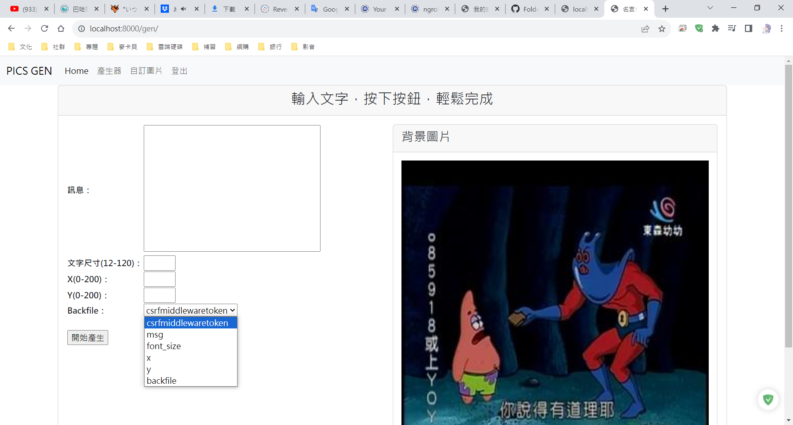

# Django Forms Not Valid

## Description

這次的練習是想要透過下拉式選單選擇圖片並且預覽圖片會隨之更改。

在之前的練習，forms通常只會引用一個參數。

```python
if request.method == 'POST':
    # only request.POST argument
    form = forms.GenForm(request.POST)
    if form.is_valid():
        # code
    else:
        print("Form is not valid!")
else:
    form = forms.GenForm()
```

可是這次只引用一個參數會有CSRF的錯誤，雖然docker的log是正確的，但在網頁裡的下拉式選單會變成奇怪的樣式，會多出`csrfmiddlewaretoken`的選項。我自己認為這個錯誤是因為在要驗證form是否有效的情況下，參數傳遞要明確，不然就是**不要**多做驗證的步驟。



程式改成下面這樣。

```python
if request.method == 'POST':
    # Pass one more arguments
    form = forms.GenForm(backfile, request.POST)
    if form.is_valid():
        # code
    else:
        print("Form is not valid!")
else:
    form = forms.GenForm()
```

## Full Code

* [forms.py](doc/forms.py)

    ```python
    import os
    from django import forms

    class GenForm(forms.Form):
        msg = forms.CharField(label='訊息', widget=forms.Textarea)
        font_size = forms.IntegerField(label='文字尺寸(12-120)', min_value=12, max_value=120)
        x = forms.IntegerField(label='X(0-200)', min_value=0, max_value=200)
        y = forms.IntegerField(label='Y(0-200)', min_value=0, max_value=200)

        def __init__(self, backfiles, *args, **kwargs):
            super(GenForm, self).__init__(*args, **kwargs)
            self.fields['backfile'] = forms.ChoiceField(
                    choices=[(os.path.basename(bf), os.path.basename(bf)) for bf in backfiles]
            )
    ```

* [views.py](doc/views.py)

    ```python
    def gen(request):
        messages.get_messages(request)
        backfile = glob.glob('{}/static/images/*.jpg'.format(settings.BASE_DIR))
        url = '/usr/src/app/ch15/static/images/'
        num_list = [eval(os.path.basename(bf).split('.', 1)[0]) for bf in backfile]
        num_list.sort()
        backfile = [url + str(num) + '.jpg' for num in num_list]
        if request.method == 'POST':
            form = forms.GenForm(backfile, request.POST)
            if form.is_valid():
                saved_filename = mergepic(request.POST.get('backfile'),
                                            request.POST.get('msg'),
                                            int(request.POST.get('font_size')),
                                            int(request.POST.get('x')),
                                            int(request.POST.get('y')),)
            else:
                print("Not valid!!")
        else:
            form = forms.GenForm(backfile)
        return render(request, 'gen.html', locals())
    ```

> ## 參考文件
>
> https://docs.djangoproject.com/en/4.1/ref/csrf/
>
> https://stackoverflow.com/questions/47363190/from-the-view-how-do-i-pass-custom-choices-into-a-forms-choicefield
>
> https://stackoverflow.com/questions/53190973/django-forms-choicefield-overriding-forms-init
>>
