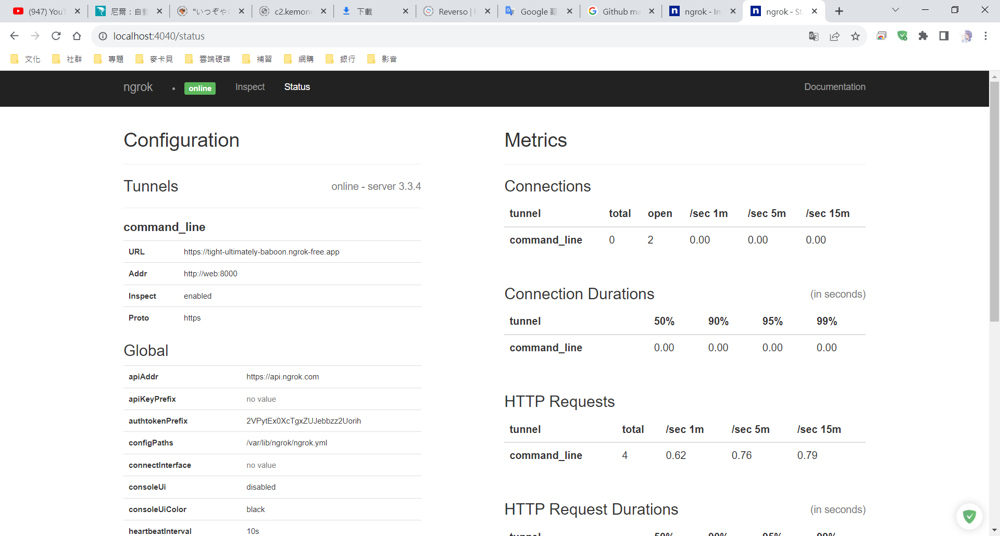
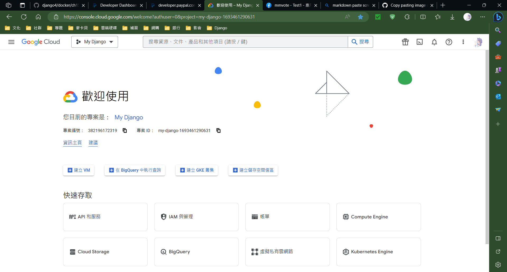
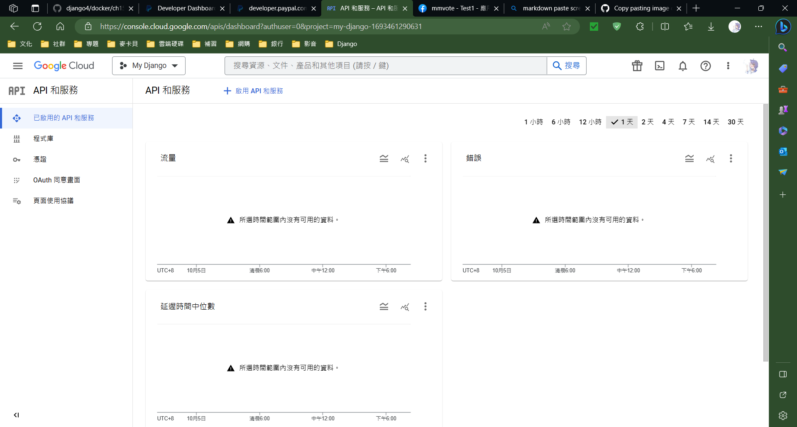
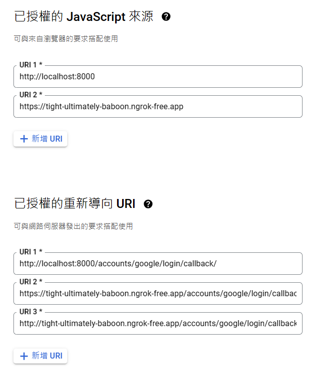
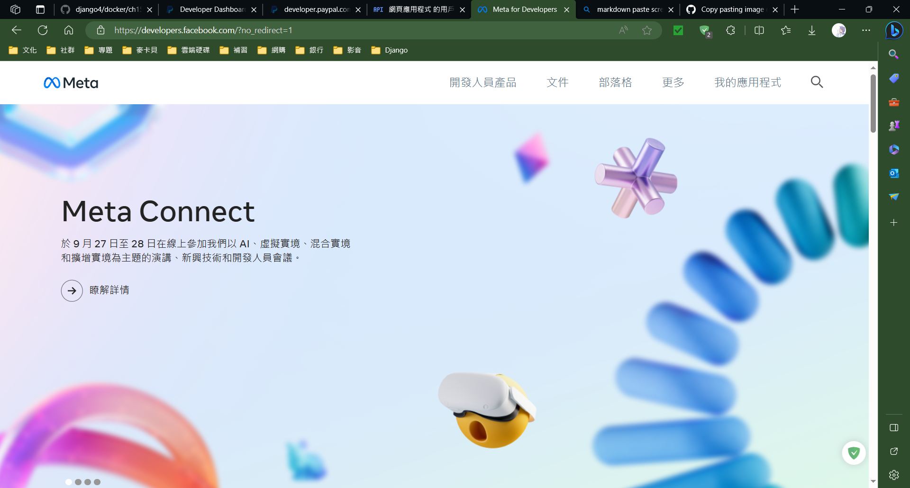
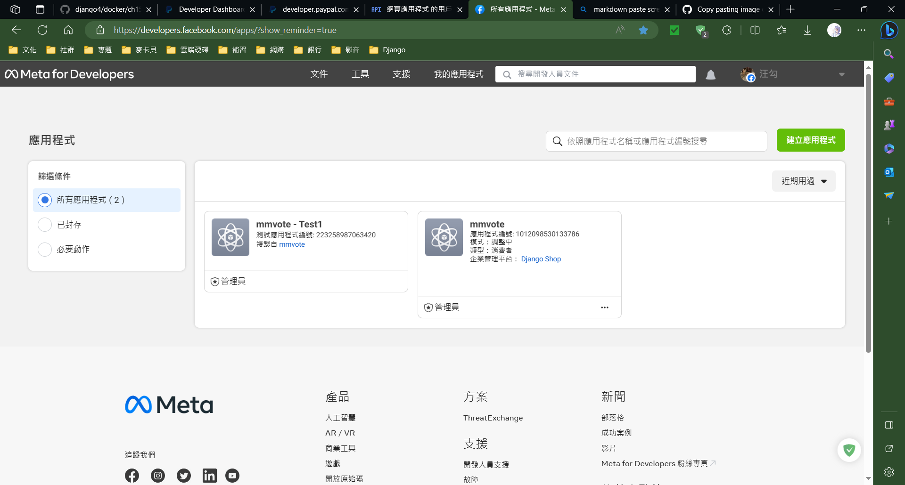
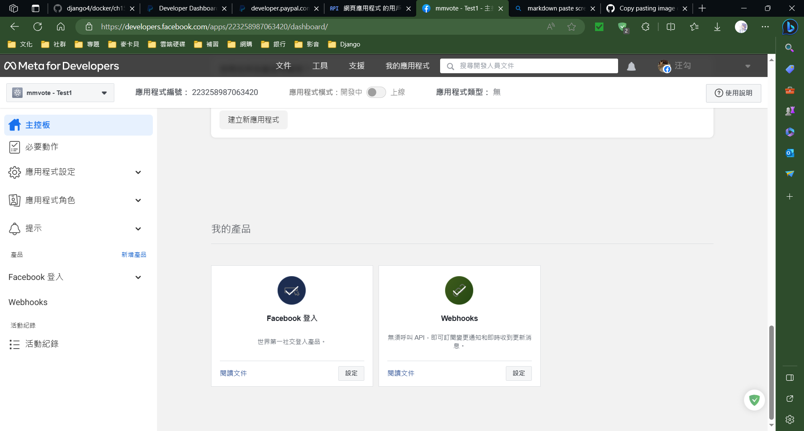
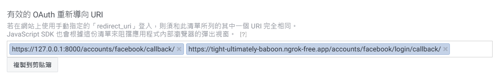
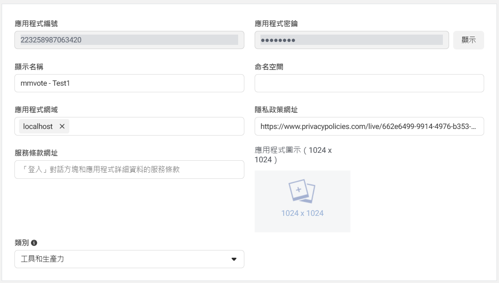
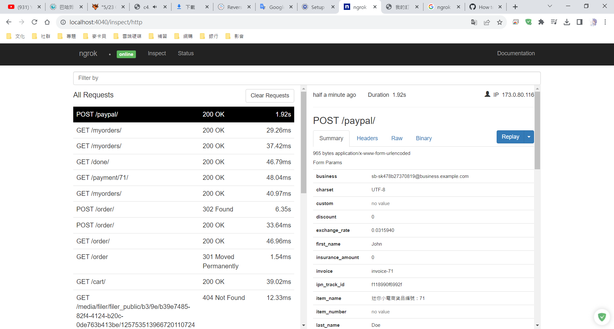

# 使用PayPal付款和登入購物網站的問題

## Description

* 在Django設計一個簡易的購物網站，包含有購物車功能、線上支付功能、透過第三方驗證登入，但在實際操作中遇到一些問題。下面會提到問題和解決方案，目前(2023/10/1)測試是有效的，但也有一些限制。

## Issue

1. 購買完成後，網頁沒有成功觸發完成付款的Signals。

2. 在Docker使用Ngrok無法執行。

3. Ngrok無法和localhost:8000連接。

4. 使用Ngrok的網址有CSRF問題。

5. 第三方驗證無法登入購物網站。

## Solution

1. 因為PayPal無法透過localhost:8000這個網址存取主機(localhost:8000只能用在本地主機)，除非我們更改網路配置，公開80 port讓PayPal能存取主機。但這裡我們透過Ngrok來幫忙。

    > [!NOTE]
    > Ngrok是一個可以把自己的主機透過Ngrok的應用程式公布到網路上的平台。
    > 在[官網](https://ngrok.com/docs/)就提到**ngrok is the fastest way to host and secure your applications and services on the internet.**

2. 只要使用[`docker-compose-ngrok.yml`](doc/docker-compose-ngrok.yml)啟動就可以了。

    ```YAML
    version: '3.7'

    services:
    ngrok:
        image: ngrok/ngrok:latest
        command: http web:8000
        volumes:
        - type: bind
            source: ./ngrok
            target: /var/lib/ngrok
        ports:
        - "4040:4040"
        networks:
        - app-net

    ```

    > [!NOTE]
    > command: http web:8000的`web`是要加上去的，因為是使用Docker的內部網路，加上Hostname讓Ngrok認識

3. 確定docker-compose-ngrok.yml完成後，要加入[config檔](https://ngrok.com/docs/secure-tunnels/ngrok-agent/reference/config/)，命名[`ngrok/ngrok.yml`](doc/ngrok/ngrok.yml)。

    ```YAML
    authtoken: 2VPytEx0XcTgxZUJebbzz2Uorih_27BwF3J1PcyPweXGa5vni
    web_addr: 0.0.0.0:4040
    version: 2

    # This is the region where the ngrok agent will connect to.
    region: jp

    # Enable or disable the console UI that is displayed in your terminal window after starting ngrok.
    console_ui: True
    tunnels:
        web:
            addr: 8000
            proto: http

    ```

    > [!NOTE]
    > `authtoken`去[Ngrok官網](https://dashboard.ngrok.com/get-started/your-authtoken)登入帳號取得。

    > [!IMPORTANT]
    > 啟動容器後，瀏覽`localhost:4040`，點擊上面的status，記住command\_line的URL後面會使用它。<br>在這個專案URL是`https://tight-ultimately-baboon.ngrok-free.app`。如圖 :

   

4. 原本在本地主機可以利用`@csrf_exempt`和``來避免CSRF問題。但在Ngrok需要設定一些配置。
    * settiongs.py

    ```PYTHON
    CSRF_TRUSTED_ORIGINS = [
        'https://tight-ultimately-baboon.ngrok-free.app',
    ]

    CORS_ORIGIN_WHITELIST = [
        'https://tight-ultimately-baboon.ngrok-free.app',
    ]
    ```

5. 這個問題目前只有在Google可以解決，Facebook還找不到問題(2023/10/05已解決)。
    * 設定步驟
        * Google
            1. 登入[Google Cloud](https://console.cloud.google.com/welcome?authuser=0&project=my-django-1693461290631)
            2. 進入`API 和服務`
                
            3. 進入`憑證`
                
            4. 點擊`建立憑證`
                * OAuth用戶端憑證
                * 應用程式類型 : 網頁應用程式
                * 已授權的JavaScript來源 : https://tight-ultimately-baboon.ngrok-free.app
                * 已授權的重新導向URI : http://tight-ultimately-baboon.ngrok-free.app/accounts/google/login/callback/
                
                > [!NOTE]
                > 已授權的重新導向URI<br>ngrok URL + `/accounts/google/login/callback/`

                > [!WARNING]
                > 已授權的重新導向URI要注意是使用`http`還是`https`，在測試時，是兩種都加上去。
        * Facebook
            1. 登入[Facebook Developers](https://developers.facebook.com/?no_redirect=1)
            2. 點擊右上角`我的應用程式`
                
            3. 點擊右上角`建立應用程式`，完成後，左上角`建立測試應用程式`
                
            4. 點擊畫面下方`新增產品`的`Facebook 登入`
                
            5. 左邊列表點擊Facebook 登入的`設定`
                * 有效的 OAuth 重新導向 URI : https://tight-ultimately-baboon.ngrok-free.app/accounts/facebook/login/callback/
                > [!NOTE]
                > 有效的 OAuth 重新導向 URI<br>ngrok URL + `/accounts/facebook/login/callback/`
                
            6. 左邊列表點擊`應用程式設定`的`基本資料`
                * `隱私政策網址`可以透過[這個網站](https://www.privacypolicies.com/)生成
                * `類別`選擇`工具和生產力`
                
            7. 設定Settings.py

                ```PYTHON
                ACCOUNT_DEFAULT_HTTP_PROTOCOL = 'https'
                ```

## 完成

* Ngrok會Mapping本地主機，可以透過瀏覽Ngrok產生的網址看網站，也可以透過`localhost:4040`瀏覽Ngrok的細節。
* 現在可以測試第三方驗證登入，這裡使用Google和Facebook。
* 完成登入後，測試購買流程。

> [!WARNING]
> 付款完成資訊會比較慢完成，要稍微等一下。

> [!NOTE]
> 完成付款會有這筆紀錄。


